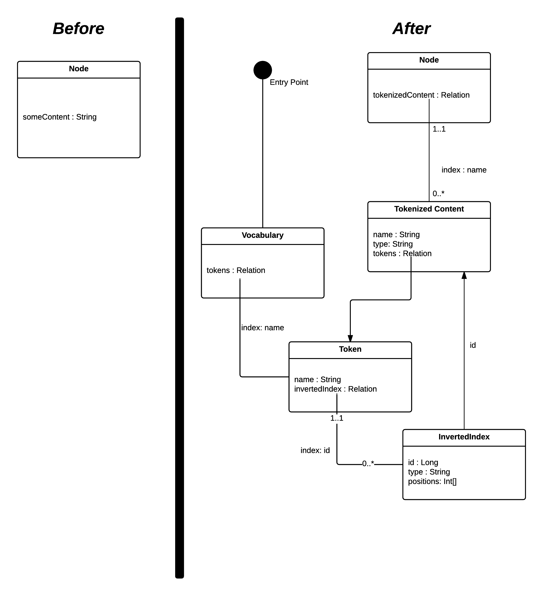

# Paw: A Tokenizer plugin for GreyCat

This library bring additional functionality to the [GreyCat](https://github.com/datathings/greycat) project. 
This library is compatible with the latest Greycat api. 
Compatibility with previous versions of Greycat(formerly MWDB) api is not supported.

### Token?

This project aims at providing a way to tokenize all of string that one might want to store in the graph.
In addition to saving space, it also enable further analytics. Every tokenized content being accessible through a vocabulary node globally indexed. 
The library supports time and world, every new word being created at the Beginning of Time and first world.

### How does it work?

### Set of Provided Actions

* Initialize Voacabulary
* Retrieve Vocabulary Node
* Get or create Token From String
* Tokenize String Using Tokenizer
* Create or Update Tokenize Relation to Node

### How to use this library?

In progress
